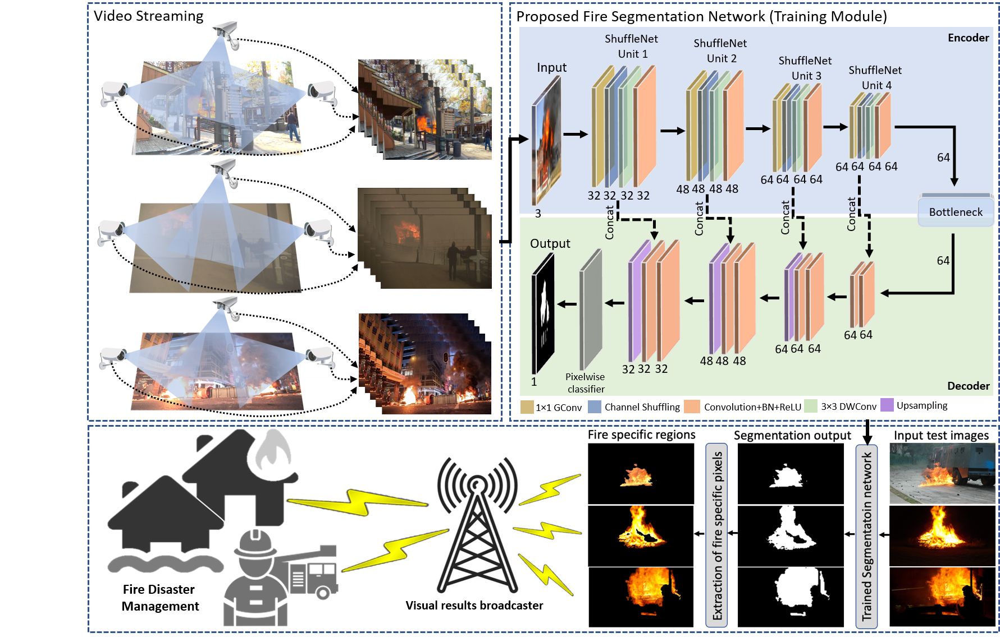
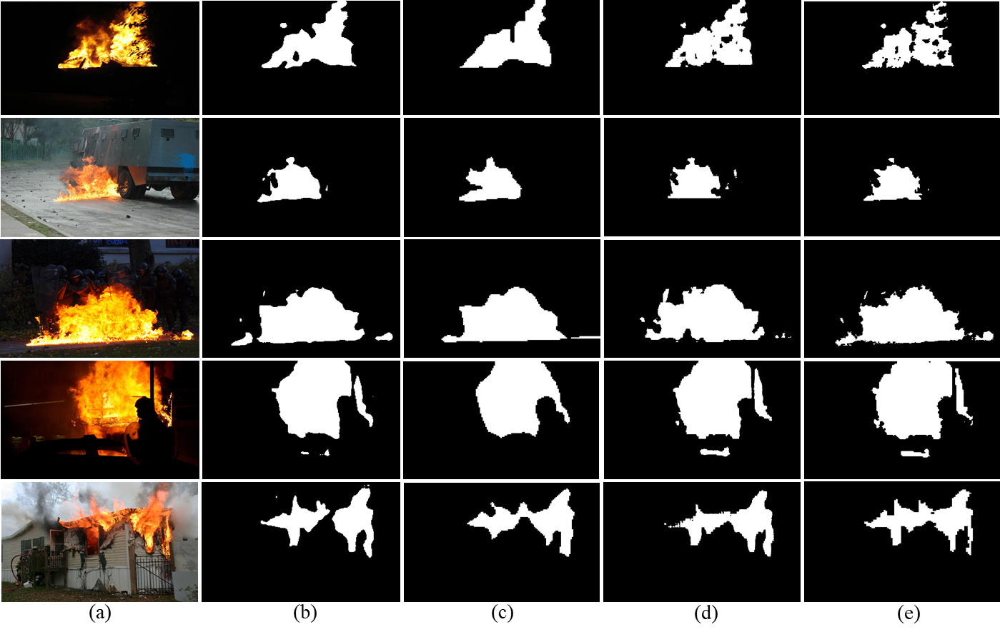
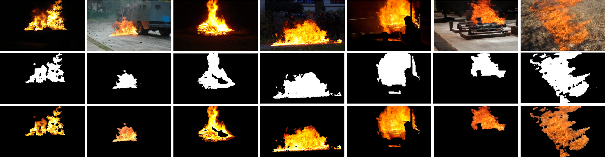
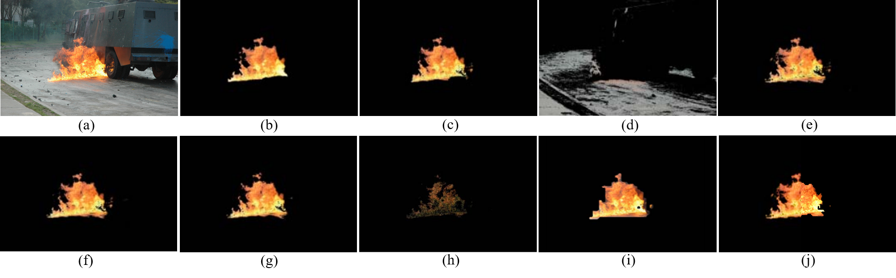
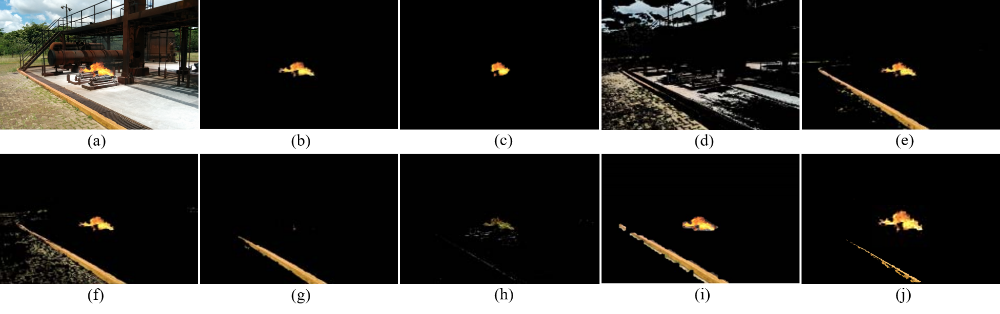
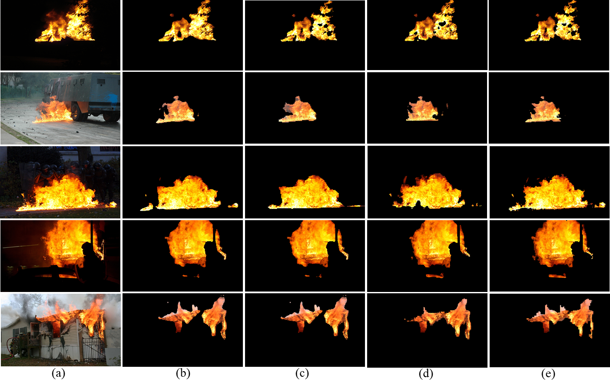

# Fire Segmentation
Efficient Fire Segmentation for Internet-of_Things-Assisted Intelligent Transportation Systems [paper](https://ieeexplore.ieee.org/abstract/document/9894370)



## Introduction
This repo contains the implementation of our proposed fire segmentation method, the prerequisite libraries, and link of our newly created dataset we have used in our experiments. For testing purpose we also provide a trained model weights and test fire images.

## Installation
This code is written with Anaconda python 3.7. Install the Anaconda python 3.7 and clone the repo with the following command:
``` 
git clone https://github.com/hayatkhan8660-maker/Fire-Segmentation-for-Intelligent-Transportation-System
cd Fire-Segmentation-for-Intelligent-Transportation-System
```

### Dependencies
This code requires the following libraries, install these libraries before testing code. 
- keras_segmentation
- numpy == 1.21.6
- h5py == 2.10.0
- opencv-python == 4.6.0
- tqdm == 4.64.0
- tensorflow == 2.9.1
- keras == 2.9.0

run ```pip install -r requirements.txt``` to install all the dependencies. 

### Our Fire Segmentation Dataset and its Training Setup
Our fire segmentation dataset consist of fire images and their corresponding annotated fire masks. For training, we divided the dataset into two subsets i.e., train and test sets. Where each set contains fire images and their corresponding annotated fire masks. [Dataset Link](https://drive.google.com/drive/folders/1Xfq7zLwIwJ4vPx50G-k7j2-ofh1bj3fx?usp=sharing)

The structure of the dataset directory should be as follows:

```
Fire Dataset
├── images_prepped_train
│   ├── img(1).jpg
│   ├── img(2).jpg
│   ├── img(3).jpg
│   ├── .....
├── annotations_prepped_train
│   ├── img(1).png
│   ├── img(2).png
│   ├── img(3).png
│   ├── .....
├── images_prepped_test
│   ├── img(1).jpg
│   ├── img(2).jpg
│   ├── img(3).jpg
│   ├── .....
├── annotations_prepped_test
│   ├── img(1).png
│   ├── img(2).png
│   ├── img(3).png
│   ├── .....

```

## Training
Run the following command to train the proposed fire segmentation model on our fire segmentation dataset.
```
python train.py --train_images "path to input training fire images" 
--train_annotations "path to input training annotations fire masks"
--validation_images "path to input validation fire images"
--validation_annotations "path to input validation annotations fire masks"
--checkpoints_path "path to output training checkpoints"
--trained_weights "path to output training weights"
--epochs number_of_epochs
```

## Test
Run the following command to test the proposed trained model for fire segmentation task on the images from test set.
```
python test.py --test_mode "single|multiple|video"
```
User can decide the test_mode by providing appropriate argument.

- single: it run the test.py for single image fire segmentation.
- multiple: it run the test.py for multiple images fire segmentation based on the provided test images directory.
- video: it run the test.py for fire segmentation in video.

## Fire Extraction
Run the following command to extract fire specific regions from the input fire image using model predicted segmentation mask.

```
python fire_extraction.py --input_image "input fire image" 
--segmented_image "corresponding model segmented image"
--fire_specific_image "fire sepecific pixels image"

```
Comparative results of our method and other state-of-the-art cnn architectures on our newly created fire segmentation dataset.

| Method  | Pixel<sub>accuracy</sub> | Mean<sub>accuracy</sub> | Mean<sub>IoU</sub> | FW<sub>IoU</sub>|
| ------------- | ------------- | ------------- | -------------| ------------- |     
| UNet+VGG16   | 85.22  | 61.30 | 56.19 | 76.84 |
| UNet+ResNet50  | 88.43  | 69.17 | 62.47 | 79.92 |
| UNet+MobileNetV1 | 88.29 | 71.05 | 63.56| 80.15 |
| Proposed | 89.54 | 74.27 | 67.39 | 82.64|

Comparative results of our proposed method and other state-of-the-art segmentation networks on test set.

| Method  | Pixel<sub>accuracy</sub> | Mean<sub>accuracy</sub> | Mean<sub>IoU</sub> | FW<sub>IoU</sub>|
| ------------- | ------------- | ------------- | -------------| ------------- |     
| SegNet   | 84.63  | 75.92 | 80.41 | 87.66 |
| FCN  | 85.76  | 75.47 | 72.65 | 89.20 |
| PSPNet | 88.17 | 78.62 | 74.19| 89.58 |
| Proposed | 94.54 | 85.27 | 83.35 | 93.96| 

Comparative quantitative results of our method and other fire segmentation methods based on MFLPOS/image, model size, and frames per second (FPS).

| Method  | MFLOPS/image | Model Size (MB) | FPS | 
| ------------- | ------------- | ------------- | -------------|      
| UNet+ResNet50   | 3860  | 74.2 | 21 |
| UNet+VGG16 | 15300  | 62.9 | 22 | 
| UNet+MobileNetV1 | 569 | 17.2 | 26| 
| EFDNet | - | 4.80 | 63 |  
| CNNFire | 833 | 3.06 | 20 |  
| Proposed | 140 | 1.49 | 27 |  

## Obtained Visual Results from Conducted Experiments 
Following are the visual results obtained by our proposed fire segmentation method from different experimental setups.











## Obtained Results on Video 
Following results are obtained by testing our proposed method on fire videos.


## Citation
If you use our work in your research or wish to refer to the baseline results published here, please use the following entries for citation.

BbibTex
```
@article{muhammad2022efficient,
  title={Efficient Fire Segmentation for Internet-of-Things-Assisted Intelligent Transportation Systems},
  author={Muhammad, Khan and Ullah, Hayat and Khan, Salman and Hijji, Mohammad and Lloret, Jaime},
  journal={IEEE Transactions on Intelligent Transportation Systems},
  year={2022},
  publisher={IEEE}
}
```
EndNote
```
Muhammad, Khan, Hayat Ullah, Salman Khan, Mohammad Hijji, and Jaime Lloret. 
"Efficient Fire Segmentation for Internet-of-Things-Assisted Intelligent Transportation Systems." 
IEEE Transactions on Intelligent Transportation Systems (2022).
```
